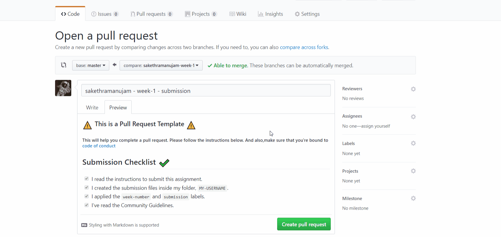
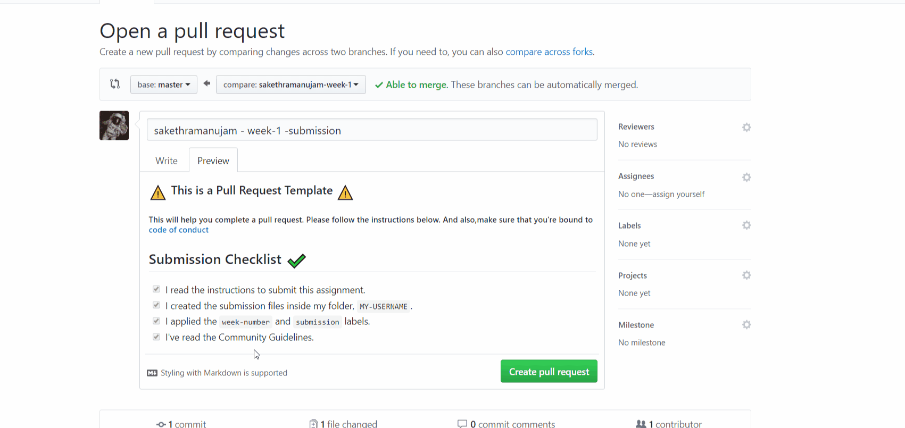

# Pull-Request-Guidelines :lock_with_ink_pen:

## For Member Submissions
- Please open a pull request only if you're submitting a solution / assignment.
- Follow the pull request template and make sure you've read the organization guidelines.
- If in case you need any specific person to review your pr, please assign them as follows

- Add the ```submission``` and ```assignment number``` or the ```week-number``` label.

- Check for the comments section for response regarding merging and feedback.
- Bring to the notice of maintainers if your pull request is not merged even after 4-5 times of reopening.


:tada: Now go make your first pr!

## For Content - Moderators/ Creators

- Please label your commits as per the [commit guidelines](https://github.com/GVP-AI-Club/Organization-Guidelines/blob/master/commit-guidelines.md).
- Follow the pull request template and make sure you've read the organization guidelines.
- Add the appropriate label such as ```bugfix``` ```update``` etc.,
- Check for the comments section for response regarding merging and feedback.
- Add **WIP** infront of the commit name if you wish to continue work on it and then be merged automatically.

